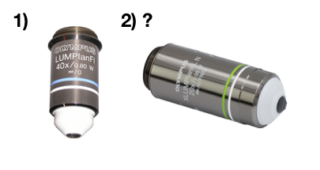

# Instrumentation

**Objectifs**

1. Définir et savoir identifier les diaphragmes d’entrée et de champ, les pupilles d’entrée et de sortie, les fenêtres d’entrée et de sortie
2. Expliquer l’importance des diaphragmes dans un instrument
3. Définir et savoir tracer le rayon principal et la rayon marginal d’une source ponctuelle
4. Définir le $f_\#$ d’un système.
5. Savoir calculer la quantité de lumière captée par un système

**Lecture préparatoire**

1. Notes de cours "Optique" de Daniel C. Côté, Chapitre 2, section 3 ([iBook](https://itunes.apple.com/us/book/optique/id949326768?mt=13) ou [iPDF](https://www.dropbox.com/s/ms9onzkg4y4771n/Optique-1.1.9.pdf?dl=0)).
2. Pedrotti, Chapitre 6
3. Hecht, Section 5.3
## Objectif et résolution

*Durée: 1m*

### Question

Est-ce qu’un objectif 40x a une résolution optique spatiale meilleure ou pire qu’un objectif 100x ? Pourquoi?

### Réponse

Impossible à dire.  La résolution optique est donnée par l'ouverture numérique ou par le $f_\#$, et cette information n'est pas donnée.  Le 40x ou 100x ne nous donne que la distance focale de l'objectif: elle est 40x ou 100x plus petite que celle du *tube lens*.

## Balayage en $x$ et $\theta$

*Durée: 5m*

### Question

Prouver à l’aide des matrices ABCD qu’un balayage en angle au point focal donne un balayage en X/Y à l’autre point focal ?

### Réponse

Deux méthodes: par matrice ABCD ou par raisonnement de secondaire 5. 

Un faisceau provenent du point focal ressort parallèle à l'axe.  Par géométrie on obtient $y = f \theta$.

Par matrices ABCD, on obtient simplement:
$$
\Biggl[ 
\begin{matrix}
1 & 0 \\
-\frac{1}{f} & 1
\end{matrix}
\Biggr]

\Biggl[ 
\begin{matrix}
1 & f \\
0 & 1
\end{matrix}
\Biggr]

\Biggl[ 
\begin{matrix}
0 \\
\theta 
\end{matrix}
\Biggr]

= \Biggl[ 
\begin{matrix}
1 & f \\
-\frac{1}{f_1} & 0
\end{matrix}
\Biggr]

\Biggl[ 
\begin{matrix}
0 \\
\theta 
\end{matrix}
\Biggr]

= 
\Biggl[ 
\begin{matrix}
f \theta \\
0 
\end{matrix}
\Biggr]
$$
Le rayon sort à une hauteur de $ y = f \theta$ et parallèle à l'axe car $\theta = 0​$.

## Champ de vue microscope à balayage

*Durée: 120m*

### Question

Le microscope suivant, qui fonctionne avec un laser Ti:sapphire et un objectif Olympus 40x 0.8 NA (Objectif #1 ci-dessous), permet de balayer à 30 images par secondes avec un polygone à 36 faces. Tout l'optique a 1 pouce de diamètre.

1. Quel est le champ de vue du microscope?

2. Quel est la résolution optique du microscope?

3. Si vous numérisez de façon idéale, quelle sera la taille de l'image (micron et pixels) à 30 images par secondes?

4. J'aimerais utiliser le 20X (Objectif #2 ci-dessous). Est-ce possible? Est-ce que j'ai des modifications à faire? Qu'arrivera-t-il au champ de vue?

5. Après avoir complété vos calculs, que devriez vous vérifier pour confirmer le tout? Où sont les incertitudes dans votre système?

   

   

### Réponse

